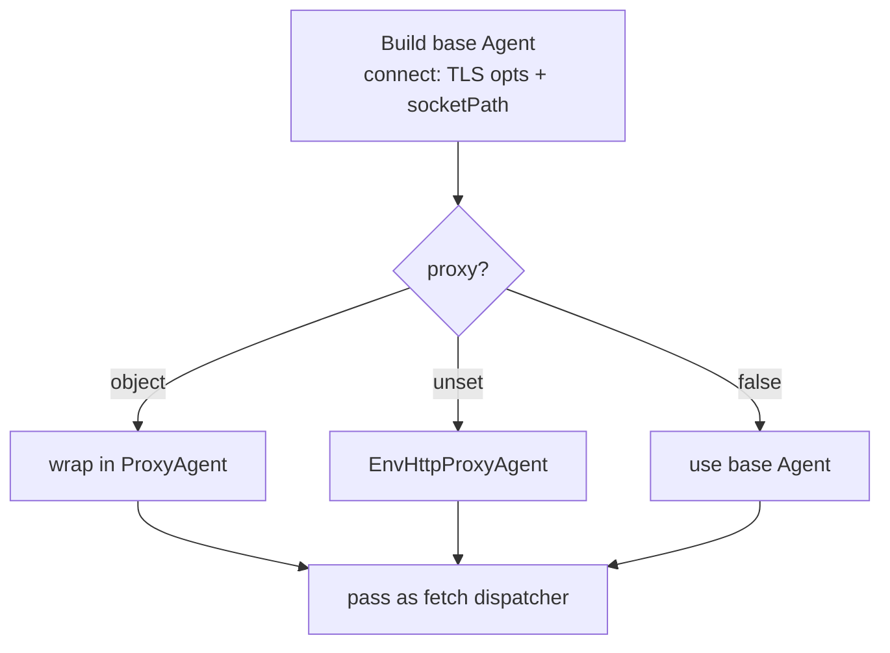

# Axios to Fetch Migration - Plan

## Goal Capsule

- **Objective:** wait-on's HTTP(S) resource checks behave identically after axios is removed from runtime dependencies — every existing option, prefix, and resource type still resolves the same success/failure.
- **Means:** replace axios with Node's native `fetch`, using an `undici` dispatcher for the TLS, proxy, and unix-socket features fetch alone cannot provide.
- **Product authority:** repo owner.
- **Open blockers:** none. The dependency strategy (fetch + undici) is settled.

---

## Product Contract

### Summary

Replace axios with Node's native `fetch` at wait-on's single HTTP(S) call site (`lib/wait-on.js`). Node-specific transport features axios supplies through options — client TLS, proxy, unix sockets — move to an `undici` dispatcher. Behavior stays identical; the existing test suite is the parity bar. Net dependency change: remove `axios`, add `undici` (smaller, and already what Node's `fetch` uses internally).

### Problem Frame

axios is a full HTTP client carried for one narrow job: does a HEAD/GET to a resource succeed. It is a heavy runtime dependency with a recurring CVE history, and Node 20 (wait-on's minimum) now ships a native `fetch`. The cost is ongoing dependency weight and supply-chain surface for functionality the platform now provides. The catch is that `fetch` alone cannot cover three axios options wait-on exposes — client certificates, proxy, and unix-socket URLs — which is why the swap is a real migration and not a one-line find-replace.

### Key Decisions

- KD1. **Target native `fetch` plus an `undici` dispatcher.** (session-settled: user-directed — chosen over a zero-dependency Node `http`/`https` rewrite and over keeping axios.) `fetch` has no per-request TLS/proxy/socket knobs; an `undici` dispatcher supplies them and is lighter than axios. Governs R2, R3, R6, R9.
- KD2. **Replicate axios `validateStatus` semantics in a thin wrapper.** `fetch` never rejects on HTTP status, so success must be decided after the response resolves: default success is 2xx, a user `validateStatus(status)` overrides it, and network errors/timeouts are failures. Governs R4.
- KD3. **The parity bar is a green test suite, not log-format identity — but the existing suite must be extended.** No test asserts the verbose HTTP log string, so the debug log line may be reformatted to fit the `fetch` Response shape. The existing suite does not cover proxy (R9) or TLS client options (R2 — `ca`/`cert`/`key`/`strictSSL` are untested, and AE4's self-signed case does not exist yet), so authoring tests for R2 and R9 is a required part of the parity bar, not an assumed one. Governs R2, R7, R9, and see Scope Boundaries.
- KD4. **Compose one dispatcher per request.** TLS `connect` options and `socketPath` combine into a single `undici` Agent, wrapped in a proxy dispatcher when `proxy` is set — replacing the current per-request `httpsAgent`. Governs R2, R3, R9.

### Option mapping

The crux of the migration — how each axios option currently built in `createHTTP$` maps onto `fetch` + `undici`:

| axios option (today) | fetch / undici equivalent |
|---|---|
| `method` (`get`/`head`) | `fetch(url, { method })` |
| `url` / `urlSocketOptions.url` | `fetch` first arg — for unix sockets resolve with `new URL(parsedPath, 'http://localhost')` (handles both the relative short form `/foo` and the absolute form `http://localhost/foo`; see KTD4) |
| `auth: {username, password}` | `Authorization: Basic <base64>` header |
| `headers` | `fetch(url, { headers })` |
| `validateStatus` fn | applied after `await fetch(...)` on `res.status` (KD2) |
| `httpsAgent` TLS (`ca`/`cert`/`key`/`passphrase`, `rejectUnauthorized`) | `new Agent({ connect: { ca, cert, key, passphrase, rejectUnauthorized } })` as `dispatcher` |
| `socketPath` (`http://unix:`) | `new Agent({ connect: { socketPath } })` as `dispatcher` |
| `proxy` (object / `false` / unset) | `ProxyAgent` when object (translate the axios `{host,port,auth,protocol}` object to a `uri` string; see KTD1); plain Agent when `false`; env-honoring dispatcher when unset — but a `socketPath` request always takes the base Agent (KTD1). Env parsing (`NO_PROXY`, precedence) differs from axios, so unset is not drop-in parity (see Outstanding Questions) |
| `maxRedirects: 0` vs default | `redirect: 'manual'` vs `redirect: 'follow'` |
| `timeout` (axios option, fed from wait-on's `httpTimeout` — not wait-on's overall `timeout` option) | `AbortSignal.timeout(httpTimeout)` |

### Requirements

**HTTP behavior parity**

- R1. HTTP and HTTPS checks (`http:`, `https:`, `http-get:`, `https-get:`) resolve success/failure identically to today — HEAD for the plain prefixes, GET for the `-get:` prefixes.
- R4. Success logic is unchanged: default success is 2xx; a supplied `validateStatus(status)` overrides it; network errors and timeouts are failures.
- R5. `followRedirect` keeps its current default (true) and its false behavior — do not follow, and a 3xx then fails the default 2xx check.
- R8. Basic `auth` (`{username, password}`) still authenticates the request.
- R10. `httpTimeout` still bounds each request, and a timeout is treated as a failure rather than a hang.

**Node-specific transport parity (via undici dispatcher)**

- R2. TLS client options (`ca`, `cert`, `key`, `passphrase`) and `strictSSL` (rejectUnauthorized) still apply to HTTPS checks.
- R3. Unix-socket HTTP resources (`http://unix:SOCK:PATH`, `http-get://unix:...`) still resolve against a server listening on that socket.
- R9. `proxy` keeps axios semantics: an object sets an explicit proxy, `false` disables proxying, and unset honors environment proxy variables. Exact env-proxy parity (`NO_PROXY` and variable precedence) is not assumed drop-in and is tracked in Outstanding Questions.

**Dependency and packaging**

- R6. `axios` is removed from `package.json` dependencies; `undici` is added.
- R7. No public API change: `WAIT_ON_SCHEMA` options, defaults, and documented resource prefixes stay identical; only internal HTTP transport changes.

### Acceptance Examples

- AE1. **Covers R4.** A resource returns 401 and the caller passes `validateStatus: (s) => s === 401` — the resource is considered available.
- AE2. **Covers R5.** A resource returns 301. With `followRedirect: false` the check fails; with `followRedirect: true` (default) it follows to a 2xx and succeeds.
- AE3. **Covers R3.** `http://unix:/path/sock:/foo` with an HTTP server listening on that socket path — the check succeeds.
- AE4. **Covers R2.** An HTTPS endpoint with a self-signed cert: `strictSSL: true` fails the check; `strictSSL: false` passes it.
- AE5. **Covers R10.** A resource that never responds within `httpTimeout` — the check reports failure promptly rather than hanging.

### Scope Boundaries

- Only the HTTP(S) resource check changes. `file:`, `tcp:`, and `socket:` checks use `fs`/`net` and are untouched.
- No new options, no changed defaults, no changed resource-prefix syntax.
- The verbose HTTP log line's exact format may change (a `fetch` Response is shaped differently from an axios response). This is debug-only output, asserted by no test, and is not treated as a breaking change.
- The minimum Node version **is** raised to `>=22.19.0`. Native `fetch` ships in Node 20, but `undici@^8` (used for the dispatcher) requires Node `>=22.19.0`, so `engines.node` follows undici's floor. (Original scope assumed the floor could stay at `>=20`; that was inconsistent with the `undici@^8` choice — surfaced in code review. Pinning `undici@^6` would keep a Node 18/20 floor if preserving it matters more than tracking undici's latest.)

### Outstanding Questions

**Deferred to Planning**

- Verify the combined case is achievable before committing R2+R9 parity for it: `proxy` + client cert, or `proxy` + unix socket. undici's `ProxyAgent` tunnels via HTTP CONNECT and may not attach per-request client-cert or `socketPath` TLS to the origin; if it cannot, those combinations need a fallback (e.g. bypass `ProxyAgent`) or an explicit parity carve-out. This is verification work, not an assumed composition detail.
- Env-proxy parity: axios (proxy-from-env) and undici's env dispatcher parse `NO_PROXY`, variable casing, and precedence differently. Planning decides whether to match axios's `NO_PROXY` semantics exactly (with a test) or document the difference as an accepted change under R9.
- Whether to read the response body at all. HEAD has none; the GET body is only used in the verbose log. Skipping is NOT cost-free: axios's `timeout` bounds the whole request+body while `fetch` resolves at headers, so for a fast-headers/slow-body server an `http-get:` check would succeed under fetch but fail under axios. To preserve GET timeout parity, consume the body under the same `AbortSignal` rather than skipping it.
- `undici` version pin, and whether to add it as an explicit dependency versus relying on Node's bundled copy (this plan assumes an explicit dependency for a stable import surface).

### Sources / Research

- `lib/wait-on.js:9`, `:16`, `:313` — the only axios import, instance, and call site.
- `lib/wait-on.js:267-324` — `createHTTP$` builds `httpOptions`; `httpCallSucceeds` is the swap target.
- `lib/wait-on.js:26-52` — `WAIT_ON_SCHEMA` enumerates the options that must keep working.
- `test/api.mocha.js:85` — custom `validateStatus` 401 case; `test/cli.mocha.js:195-251`, `:486-522` — unix-socket HTTP cases; both files also cover https, followRedirect, and timeout. No test asserts the verbose log string.
- `package.json` `engines.node >=20.0.0` — native `fetch` is available, no polyfill needed.

---

## Planning Contract

**Product Contract preservation:** unchanged — no requirement, decision, or scope boundary was rewritten during enrichment. The Outstanding Questions the Product Contract deferred to planning are resolved below by KTD1–KTD5.

### Key Technical Decisions

- KTD1. **Dispatcher-selection matrix** (instantiates KD4). One `undici` `Agent({ connect: { ca, cert, key, passphrase, rejectUnauthorized, socketPath } })` is the base. **When `socketPath` is set, always use that base `Agent` regardless of `proxy`** — never `ProxyAgent`/`EnvHttpProxyAgent` — because undici's env/proxy dispatchers route the synthesized `http://localhost` socket request through `HTTP_PROXY` and fail (`ECONNREFUSED`), whereas axios never proxies `socketPath` connections. Otherwise: wrap the base in a `ProxyAgent` when `proxy` is an object, use `EnvHttpProxyAgent` when `proxy` is unset, and use the base `Agent` when `proxy` is `false`. The `proxy` object is axios-shaped (`{host, port, auth:{username,password}, protocol}`) and must be translated to `ProxyAgent`'s `uri` string (e.g. `` `${protocol||'http'}://${host}:${port}` `` with `auth` mapped to userinfo) — it cannot be passed through unchanged. The selected dispatcher is passed as `fetch`'s `dispatcher` option. Governs U1; covers R2, R3, R9.
- KTD2. **proxy + client-cert / proxy + unix-socket: verify-and-fallback.** (session-settled: user-directed — chosen over guaranteeing combined parity: undici's ProxyAgent CONNECT tunnel may not attach per-request TLS/`socketPath`, and the combination is an extreme edge.) During U1, confirm whether the combination works; if it does not, bypass `ProxyAgent` for those cases (direct `Agent`) and document the limit rather than blocking the migration. Governs U1.
- KTD3. **Preserve GET timeout parity by consuming the response body under the request's `AbortSignal`.** axios `timeout` bounds request+body; `fetch` resolves at headers, so a GET must read (and discard) the body under the same signal rather than skipping it. Governs U1; covers R10.
- KTD4. **Resolve unix-socket resources to an absolute URL with `new URL(parsedPath, 'http://localhost')`.** `HTTP_UNIX_RE` yields a *relative* path for the short form (`http://unix:/sock:/foo` → `/foo`, which `fetch` rejects) and an *absolute* one for the form the existing suite uses (`http://unix:/sock:http://localhost/foo` → `http://localhost/foo`). `new URL(parsedPath, 'http://localhost')` yields `http://localhost/foo` for both; naive concatenation would corrupt the absolute form into `http://localhosthttp://localhost/foo`. Governs U1; covers R3.
- KTD5. **Env-proxy via `EnvHttpProxyAgent`, with a `NO_PROXY` test — except for socket checks.** Use it for the unset case only when `socketPath` is not set (socket checks always take the base `Agent`, per KTD1); add a test asserting `NO_PROXY` behavior and document any residual `NO_PROXY`/precedence difference from axios as an accepted change under R9. Governs U1, U3; covers R9.

### High-Level Technical Design

Per-request dispatcher selection (KTD1), the one branching decision in the migration:

`httpCallSucceeds` then: `await fetch(url, { method, headers, redirect, signal, dispatcher })`, apply `validateStatus` to `res.status` (KD2), consume the body under `signal` (KTD3), return success/failure.

### Assumptions

- `undici` is added as an explicit dependency (not relied on as a Node internal) for a stable import surface, per the Product Contract's Outstanding Questions.
- `package-lock.json` is the lockfile in use; it is refreshed when dependencies change.

---

## Implementation Units

### U1. Migrate the HTTP resource check to `fetch` + `undici`

- **Goal:** Replace axios with native `fetch` and an `undici` dispatcher at the single HTTP(S) call site, preserving all current behavior.
- **Requirements:** R1, R2, R3, R4, R5, R8, R9, R10. Implements KD1, KD2, KD4 and KTD1–KTD5.
- **Dependencies:** none.
- **Files:** `lib/wait-on.js`, `package.json` (add `undici`).
- **Approach:**
  1. Add `undici` to `dependencies`; import `Agent`, `ProxyAgent`, `EnvHttpProxyAgent` from it. Remove the `axios` import and the `axios.create({ adapter: 'http' })` instance.
  2. In `createHTTP$`, build the dispatcher per KTD1 and resolve the request URL per KTD4 (absolute URL when `socketPath` is set). Build an `Authorization: Basic` header from `auth` when present. Map `followRedirect` to `redirect: 'follow' | 'manual'`. Derive `AbortSignal.timeout(httpTimeout)` when `httpTimeout` is set.
  3. In `httpCallSucceeds`, call `fetch(url, { method, headers, redirect, signal, dispatcher })`, apply `validateStatus` to `res.status` per KD2 (default 2xx), and consume the body under the same signal per KTD3. Keep the verbose log line (reformatted to the `fetch` Response shape per KD3).
  4. Verify the proxy+cert / proxy+socket combination and apply the KTD2 fallback if needed.
- **Patterns to follow:** existing `createHTTP$` / `httpCallSucceeds` structure in `lib/wait-on.js`; the rxjs `timer(...).pipe(...)` polling wrapper is unchanged.
- **Test scenarios:** none new in this unit — the existing suite (`test/api.mocha.js`, `test/cli.mocha.js`) is the regression guard for R1/R4/R5/R8/R10 and unix sockets (R3). New coverage for the untested paths is U3.
  - **Execution note:** run `npm run test:mocha` after this unit; the existing HTTP, unix-socket, redirect, `validateStatus`-401, and timeout tests must stay green with no test changes.
- **Verification:** existing mocha suite passes unchanged; `lib/wait-on.js` no longer references `axios`.

### U2. Remove `axios` from dependencies

- **Goal:** Drop the now-unused axios dependency.
- **Requirements:** R6.
- **Dependencies:** U1.
- **Files:** `package.json`, `package-lock.json`.
- **Approach:** Remove `axios` from `dependencies`; refresh the lockfile. Confirm nothing in `lib/`, `bin/`, or `test/` still imports it.
- **Test scenarios:** `Test expectation: none -- dependency removal; covered by the full suite still passing and by a source grep for axios returning nothing.`
- **Verification:** `axios` absent from `package.json` and the lockfile; `rg axios lib bin test` returns nothing; `npm run test:mocha` still green.

### U3. Add parity tests for the untested transport paths

- **Goal:** Cover the transport features the existing suite never tested, so the parity bar (KD3) is real rather than assumed.
- **Requirements:** R2, R9. Implements KD3, KTD5.
- **Dependencies:** U1.
- **Files:** `test/api.mocha.js` (or a new `test/https.mocha.js` / `test/proxy.mocha.js` following the existing mocha + chai + `http`-server fixture convention).
- **Approach:** Use node's `https`/`http` modules to stand up fixtures, mirroring the existing `http.createServer` pattern in `test/api.mocha.js`.
- **Test scenarios:**
  - Covers AE4. An HTTPS server with a self-signed cert: `strictSSL: true` fails the check; `strictSSL: false` (default) passes it.
  - A `ca`-supplied HTTPS check against that self-signed server passes with `strictSSL: true`.
  - A unix-socket resource resolves successfully in both the short form (`http://unix:/sock:/`) and the absolute form (`http://unix:/sock:http://localhost/`) — regression guard for the URL-resolution fix (KTD4). Use a path-routing server (200 only for the expected path), not a path-agnostic one, so a corrupted path is caught.
  - A unix-socket resource resolves even when `HTTP_PROXY` is set in the environment — socket checks bypass the proxy (KTD1/KTD5); a path-agnostic server would hide this, so assert against the real socket.
  - A proxy check: with `proxy` set to a stub proxy server the request routes through it; with `proxy: false` it does not. (Depth confirmed during implementation per the scoping decision.)
  - `NO_PROXY` env var is honored for the unset-`proxy` case (KTD5).
- **Verification:** the new tests pass under `npm run test:mocha`; each previously-untested path (TLS client opts, proxy, `NO_PROXY`) now has a failing-then-passing assertion.

---

## Verification Contract

| Gate | Command | Applies to |
|---|---|---|
| Lint | `npm run lint` | all units |
| Test suite | `npm run test:mocha` | all units |
| Lint + tests | `npm test` | final |
| Coverage (optional) | `npm run test:coverage` | final |

The existing mocha suite is the behavioral parity bar for U1/U2; U3 extends it to the transport paths it never covered.

---

## Definition of Done

- `axios` is absent from `package.json` `dependencies` and the lockfile; `rg axios lib bin test` returns nothing.
- `undici` is present in `dependencies`.
- `npm test` (lint + full mocha suite) passes, including the new U3 tests.
- New parity tests exist for TLS client options (self-signed, strictSSL on/off), proxy (object / `false` / `NO_PROXY`), and the unix-socket short-form URL.
- The proxy+cert / proxy+socket combination is either confirmed working or has the KTD2 fallback plus a documented limit; no abandoned/experimental code remains in the diff.
