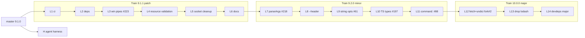
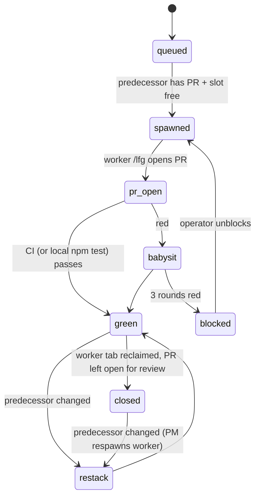

# Backlog Spine and Release Trains - Plan

**Target repos:** work lands in `kevinold/wait-on` (fork). `jeffbski/wait-on` (upstream) is read-only for this plan; submission to it happens later, by the operator.

## Goal Capsule

- **Objective:** jeffbski/wait-on can clear its accumulated backlog: fixes, features and dependency updates arrive as an ordered, individually reviewable PR sequence that maps onto patch → minor → major releases, so users get current, secure releases instead of a stalled 9.1.0.
- **Means:** a spine epic in the fork drives one stacked lane PR per unit of work, each built by a herdr worker running `/ce-worktree` + `/lfg`, with this session as PM (KTD1, KTD2).
- **Product authority:** repo owner (kevinold). Upstream maintainer decides final merges and version numbers.
- **Stop conditions:** a lane red after three babysit rounds; a worker permission dialog outside the approve-list; any action that would write to jeffbski/wait-on; the fork's CI unavailable and local tests red.
- **Repo targeting:** `origin` is jeffbski (upstream) and `fork` is kevinold. U0 first runs `gh repo set-default kevinold/wait-on`, and every worker pushes to `fork` and passes `-R kevinold/wait-on` on each `gh` write.
- **Execution profile:** PM session in herdr workspace `w1V`, pool cap 3, workers in tabs `w<sub> <slug>`. Workers ship PRs; nobody merges (KTD2).

---

## Product Contract

### Summary

Fourteen lanes across three release trains, plus one independent agent-harness lane. Each lane is one PR in the fork, stacked on the previous lane's branch in a single linear stack, so upstream can merge them in order and cut 9.1.1, 9.2.0 and 10.0.0 at the train boundaries. Upstream contributor PRs are rebased into lanes with authorship kept. Superseded, duplicate and support-only items are recorded in a triage ledger (Appendix) for the operator to post upstream later.

### Problem Frame

Upstream has 50 open issues and 13 open PRs, some from 2017. Several are confirmed live bugs in 9.1.0 (silent timeouts on malformed URLs, `tcp://`, IPv6 `tcp:[::1]` crash, leaked sockets). Three separate PRs all try to remove axios. Dependabot bumps sit unmerged. Contributors' work goes stale and conflicts with other PRs because nothing orders them. The maintainer needs work that arrives pre-ordered, pre-tested and sized for release: small PRs that are safe to merge in sequence, grouped so each group is one release.

### Key Decisions

- KD1. **Three release trains: 9.1.1 patch → 9.2.0 minor → 10.0.0 major.** Breaking changes (Node ≥22.19 floor from undici@8) wait for the major, and fixes ship first. Governs R1, R4.
- KD2. **Single linear stack, no fork merges.** (session-settled: user-directed — chosen over PM auto-merge into fork master and over operator-merges-each: dependent lanes proceed without waiting on merges.) Governs R2, R3.
- KD3. **Axios removal ships in 10.0.0 with Node ≥22.19.** (session-settled: user-approved — chosen over pinning undici@6 for a 9.x minor: Node 20 has been EOL since April 2026.) Governs R4.
- KD4. **Contributor PRs are rebased, not reimplemented.** (session-settled: user-approved — chosen over rewriting.) Original commits keep their author, and superseded authors get `Co-authored-by`. Governs R5.
- KD5. **ESM-only (#193) is out of v10.** (session-settled: user-approved — chosen over a v10 ESM lane.)
- KD6. **Agent harness is a separate, independent PR that absorbs fork PR #3.** (session-settled: user-directed.) Governs R7.

### Requirements

**Sequencing and structure**

- R1. Every lane belongs to exactly one train, and trains are ordered patch → minor → major within the stack.
- R2. Each lane is one PR whose base is the previous lane's branch (lane 1's base is `master`), so the stack replays upstream as an ordered merge list.
- R3. The spine epic lists lanes in stack order and records each lane's state, so a fresh PM session can resume from GitHub alone.

**Content**

- R4. Each confirmed-valid bug, accepted feature and dependency update in the triage ledger maps to exactly one lane, or is explicitly deferred.
- R5. Rebased contributor work keeps the original authorship, and each lane PR body names the upstream issues and PRs it closes or supersedes.
- R6. No lane writes to `jeffbski/wait-on` (no comments, PRs or closes), and no lane publishes to npm.
- R7. The harness lane lets a contributor without the owner's machine setup clone, `npm ci` and `npm test` unchanged. Agent config lives at project level only: `AGENTS.md`, `CLAUDE.md` and pi/omp-readable files.

### Success Criteria

- Every lane PR is green on the Node matrix that fits its train (20/22/24 for 9.x, 22/24/26 for 10.x) when the fork's Actions is enabled. Otherwise, `npm test` passes in the lane worktree.
- The spine epic's ordered list could be handed to the maintainer as-is: each entry is a PR link, its train, and what it closes.

### Scope Boundaries

- Posting anything upstream: no comments, closes or PRs. The Appendix ledger prepares this and the operator executes it later.
- Version bumps and npm publish. Upstream cuts versions at train boundaries.
- Hosts other than Claude Code, pi and omp in the harness lane.

### Deferred to Follow-Up Work

- 10.1 candidates: `http2` (#90, undici `allowH2`), `file-glob` (#95, `fs.promises.glob`), `http-contains` (rebase #104 onto the fetch code), `--any`/OR mode (#129, #128).
- ESM-only (#193), binary releases (#20).
- Porting relay's `scripts/multi-worker-pm/` automation into wait-on. This plan uses its spine protocol by hand (KTD1).

---

## Planning Contract

### Key Technical Decisions

- KTD1. **Hand-run spine protocol, no ported scripts.** Relay's MWPM is about 9k lines, tied to Amplify, preview bars and Renovate. wait-on has one CI workflow and no cloud, so the PM runs the same lane loop with `herdr` and `gh` directly: gate → spawn → watch → babysit → record. Only the lane YAML contract and append-only `state:` comments are kept, because they make resume possible (R3).
- KTD2. **Stacked lanes may overlap in time.** Lane N spawns once lane N−1 has an open PR with a pushed branch, not a merge. The pool cap is 3 in flight. When an earlier lane changes after later lanes branched off it, the PM prompts the later lanes' workers, in stack order, to restack with `git rebase --onto <new-predecessor-head> <old-predecessor-sha>` (the old sha is the predecessor head recorded in the lane's last `state:` comment), then `git push --force-with-lease fork`. `--update-refs` does not apply, because each lane branch is checked out in its own worktree. If a lane's worker was already reclaimed, the PM spawns a fresh worker in that lane's worktree just to restack. The stack must stay linear and clean. (session-settled: user-directed — Stack, no merges.)
- KTD3. **The CI lane goes first and drops the `pull_request: branches: [master]` filter.** Stacked PRs target lane branches, not `master`, so without this they would get no CI. `pull_request` workflows run from the PR's merge ref, so every lane stacked on lane 1 carries the fix. The change is harmless upstream.
- KTD4. **Fork PR #2 becomes lane 12 in place.** The PM re-prompts its existing worktree (`.claude/worktrees/refactor+axios-to-fetch`) to rebase `refactor/axios-to-fetch` onto lane 11's branch and retarget the PR base. It keeps issue #1 as its sub-issue. This reuses the reviewed work instead of redoing it.
- KTD5. **`cli-parseargs` uses `strict: false` in 9.2.0.** minimist silently ignored unknown flags, and strict mode would turn existing callers' typos into crashes in a minor release. Strict mode can come in a later major.
- KTD6. **Worker prompts quote lane data as untrusted.** Issue and PR bodies come from third parties. The prompt's instruction half names no lane-derived text, and the lane contract sits in a fenced `UNTRUSTED LANE DATA` block. This mirrors relay's injection boundary.
- KTD7. **Harness lane uses overdrive `--init` with `--project-plugins`, off `master`.** `--init` writes only the project-level pieces: `AGENTS.md` block, `CLAUDE.md` import, CE config, `docs/solutions/README.md`, `.gitignore` entry. `--project-plugins` records the plugins so teammates' agents offer to install them. The lane also carries this plan and fork PR #3's codebase-memory files (`mise.toml`, `.mcp.json`, `scripts/reindex-codebase-memory.sh`). Stack lanes never depend on it.

### High-Level Technical Design

Stack and trains. Arrows mean "branch based on". Lane H stands alone.



Lane lifecycle. The PM posts each transition as a `state:` comment on the lane sub-issue.



Lane contract (directional). One fenced YAML block per sub-issue body:

```yaml
lane: 4
slug: resource-validation
train: 9.1.1
branch: fix/resource-validation
base: fix/socket-... # predecessor lane branch (L1: master)
closes-upstream: [217, 140, 141]
rebase-from-upstream-pr: null # or PR number whose commits are cherry-picked with authorship
allowed-paths: [lib/wait-on.js, test/**]
```

### PM loop (per tick)

1. Run `herdr agent list` once, looking only at `w<sub>` roster names.
2. For each roster worker:
   - `blocked`: read the literal permission command. Approve per the approve-list, otherwise escalate to the operator.
   - `done` or `idle`: resolve the lane PR, check `gh pr checks`, then re-prompt `/ce-babysit-pr` or mark it green.
3. Backfill free slots with the next queued lane whose predecessor has a PR. Lane H fills any slot at any time.
4. Post `state:` comments and update the epic checklist.

The approve-list and escalate-list follow relay's non-negotiable safety rules, with these changes:
- Protected branches: `master` and any lane branch not owned by that worker.
- No AWS rules.
- Escalate any `gh` write verb that does not explicitly carry `-R kevinold/wait-on`, and any `git push` to `origin` (R6).

### Assumptions

- The operator enables GitHub Actions on the fork once, in the fork's Actions tab. Until then the green bar is local `npm test` in the lane worktree, and the PM says so on every lane.
- Upstream merges happen lane by lane. If a lane PR gets no maintainer response within 14 days, the operator offers that whole train as one PR against upstream `master` instead.
- The stale worktree `.claude/worktrees/agent-af0968e3eca720222` (scratch `verify*.mjs`, uncommitted edits) is left untouched. The PM reports it and does not remove it.

### Risks & Dependencies

| Risk | Mitigation |
|---|---|
| Restack cascade: an early-lane fix ripples through up to 13 later branches | Keep the pool cap at 3 and restack in stack order. Lanes are small, so conflicts stay local to `lib/wait-on.js` hunks |
| Fork Actions disabled, so the stack has no CI | Local `npm test` bar (Assumptions). Lane 1 still lands the trigger fix for when Actions is enabled |
| Rebasing #88 exposes known gaps (respawn every 250ms, no exec timeout) | Lane 11 fixes both explicitly (see U11) |
| undici@8 floor strands Node 20 users on 9.x | That is the purpose of the 10.0.0 major. 9.2.0 still ships every fix before it |
| Prompt injection via third-party issue/PR text | KTD6. The PM classifies only literal permission commands |

---

## Implementation Units

### Unit Index

| U-ID | Title | Key files | Depends on |
|---|---|---|---|
| U0 | Spine epic + lane sub-issues | GitHub only | — |
| U1 | L1 CI: engine-strict + stacked-PR trigger | `.github/workflows/node.js.yml` | U0 |
| U2 | L2 deps 9.1.x | `package.json`, `package-lock.json` | U1 |
| U3 | L3 Windows named pipes (#223) | `lib/wait-on.js`, workflow, tests | U2 |
| U4 | L4 resource validation | `lib/wait-on.js`, `test/api.mocha.js` | U3 |
| U5 | L5 TCP/socket cleanup | `lib/wait-on.js` | U4 |
| U6 | L6 docs 9.1.x | `README.md`, `bin/usage.txt`, `exampleConfig.js` | U5 |
| U7 | L7 parseArgs (#218) | `bin/wait-on`, `package.json` | U6 |
| U8 | L8 `--header` flag | `bin/wait-on`, `bin/usage.txt`, `README.md` | U7 |
| U9 | L9 string opts (#61) | `lib/wait-on.js` | U8 |
| U10 | L10 TypeScript types (#197) | `index.d.ts`, `package.json` | U9 |
| U11 | L11 `command:` resource (#88) | `lib/wait-on.js`, `index.d.ts`, docs | U10 |
| U12 | L12 fetch + undici (fork PR #2) | `lib/wait-on.js`, `package.json`, workflow, `index.d.ts` | U11 |
| U13 | L13 drop lodash | `lib/wait-on.js`, `package.json` | U12 |
| U14 | L14 dev-deps major | `package.json`, `eslint.config.mjs` | U13 |
| U15 | H agent harness (overdrive) | `AGENTS.md`, `CLAUDE.md`, `.compound-engineering/`, `docs/` | U0 |

Every lane PR body lists: train, stack position, predecessor PR, upstream items closed or superseded, and credited authors.

### U0. Spine epic and lane sub-issues

**Goal:** create the controlling epic in `kevinold/wait-on`, with one native sub-issue per lane carrying its YAML contract.
**Requirements:** R3.
**Dependencies:** none.
**Files:** none (GitHub issues only).
**Approach:**
1. Create the epic "Spine: upstream backlog → 9.1.1 / 9.2.0 / 10.0.0". Its body holds the ordered lane checklist grouped by train, plus the upstream submission order.
2. Create a sub-issue per lane (U1–U14) and one for H, linked as native sub-issues. For U12, link existing issue #1.
3. Post `state: queued` on each.
**Test expectation:** none -- GitHub bookkeeping.
**Verification:** the epic shows the lane sub-issues in order, and each body parses as the lane YAML.

### U1. L1 CI: engine-strict and stacked-PR trigger

**Goal:** add `npm ci --engine-strict` (#186) and run CI on PRs to any base (KTD3).
**Requirements:** R1, R2.
**Dependencies:** U0.
**Files:** `.github/workflows/node.js.yml`.
**Approach:**
- Remove the `pull_request.branches` filter.
- Make the install step `npm ci --engine-strict`.
- Keep the 20/22/24 matrix.
**Test expectation:** none -- CI config. Proof is the lane's own workflow run.
**Verification:** the PR's CI runs on all three Node versions and passes.

### U2. L2 dependency refresh (9.1.x)

**Goal:** take current compatible versions: axios ^1.20.0, joi ^18.2.9, eslint 9.39.5, mocha 11.8.0, and the transitive js-yaml and @humanfs/node bumps.
**Requirements:** R4. Supersedes upstream #221, #222, #224. Interim for #149.
**Dependencies:** U1.
**Files:** `package.json`, `package-lock.json`.
**Approach:** bump within majors only, then regenerate the lockfile.
**Test expectation:** none -- dependency bump. The existing suite is the bar.
**Verification:** `npm ci --engine-strict` and `npm test` pass on Node 20.

### U3. L3 Windows named pipes (rebase upstream #223)

**Goal:** `http://unix:` accepts Windows named-pipe paths, and CI adds a Windows row. Classified as a patch: `http://unix:` is documented as cross-platform, and on Windows it mis-parses at the first colon today, so this fixes a platform bug rather than adding a new option.
**Requirements:** R4, R5.
**Dependencies:** U2.
**Files:** `lib/wait-on.js` (`HTTP_UNIX_RE`, socket parse), `.github/workflows/node.js.yml`, `package.json` (test glob quoting), `test/api.mocha.js`, `test/cli.mocha.js`.
**Approach:** cherry-pick #223's commit, keeping its author. Resolve the workflow conflict with U1 by keeping engine-strict and the unfiltered trigger.
**Test scenarios:**
- `http://unix:\\.\pipe\name:/path` resolves the pipe and the request path. Windows row only.
- A POSIX `http://unix:/tmp/sock:/path` still resolves, which proves the old regex fallback.
- A path with extra colons after the socket part keeps the remainder as the request path.
**Verification:** green on ubuntu and windows rows.

### U4. L4 resource validation (#217, #140, #141)

**Goal:** malformed resources fail fast with an actionable error instead of polling to timeout.
**Requirements:** R4.
**Dependencies:** U3.
**Files:** `lib/wait-on.js` (`HOST_PORT_RE`, resource parse around `createHTTP$` / `createTCP$`), `test/api.mocha.js`, `test/cli.mocha.js`.
**Approach:**
- Validate http resources syntactically: require `//` right after the scheme once the prefix is stripped (`http://unix:` included), then parse with `new URL`. `new URL('http:localhost:3000/x')` parses successfully, so parsing alone cannot catch #217.
- Accept `tcp:[ipv6]:port`.
- Reject `tcp://…` with a message that points at the `tcp:host:port` form.
**Execution note:** write each reproduction as a failing test first. Each one currently times out.
**Test scenarios:**
- `http-get:localhost:P/x` rejects promptly with an error naming the resource. Covers #217.
- `tcp://127.0.0.1:P` rejects with the "use tcp:host:port" message. Covers #140.
- `tcp:[::1]:P` succeeds against an IPv6 listener. Covers #141.
- `tcp:[::1]:P` with nothing listening times out normally, with no TypeError.
- A valid `tcp:localhost:P` and `http://localhost:P` still succeed (regression).
- CLI exit code is non-zero, and stderr names the bad resource.
**Verification:** new tests pass, and none of them relies on the global timeout to fail.

### U5. L5 TCP and socket cleanup (#82)

**Goal:** stop leaking connections: `destroy()` instead of `end()` in the tcp and socket checks.
**Requirements:** R4.
**Dependencies:** U4.
**Files:** `lib/wait-on.js` (`tcpExists`, `socketExists`), `test/api.mocha.js`.
**Test scenarios:**
- After a successful tcp check, the test server sees its connection closed. The server's connection count returns to 0.
- A timed-out tcp attempt against a non-accepting socket leaves the client socket `destroyed` and no leftover `TCPWrap` in `process.getActiveResourcesInfo()`. Assert this inside the test, because `mocha --exit` masks hangs.
- A unix socket check does the same.
**Verification:** tests pass. No behaviour change beyond cleanup.

### U6. L6 docs 9.1.x

**Goal:** fix docs-only issues: #185 duplicate httpTimeout, #139 and #187 `validateStatus` from a config file, #100 `strictSSL` default, #78 HEAD vs GET, #109 localhost on Node 20+.
**Requirements:** R4, R5.
**Dependencies:** U5.
**Files:** `README.md`, `bin/usage.txt`, `exampleConfig.js`.
**Approach:** add an example `validateStatus` accepting any non-5xx to `exampleConfig.js`. List the upstream items the ledger closes against this PR.
**Test expectation:** none -- docs only.
**Verification:** each httpTimeout entry appears once, with the real default (no timeout). The example config loads under `--config` in a quick manual run.

### U7. L7 parseArgs (rebase upstream #218) — train 9.2.0 starts

**Goal:** replace minimist with `util.parseArgs` and drop the minimist dependency.
**Requirements:** R4, R5. Follows KTD5.
**Dependencies:** U6.
**Files:** `bin/wait-on`, `package.json`, `package-lock.json`, `test/cli.mocha.js`.
**Approach:** cherry-pick #218 with its author, then add a follow-up commit (KTD5) that:
- sets `strict: false`
- parses with `tokens: true` and treats the argument after an unknown `--flag` (no `=`) as that flag's value, matching minimist
- maps `no-<x>` keys to `<x>: false` by hand, because `allowNegative` needs Node ≥20.16 and the 9.x floor stays `>=20.0.0`
**Test scenarios:**
- Every documented flag in `bin/usage.txt` parses to the same option as before (table-driven).
- An unknown flag is ignored, not an error.
- `--unknown val tcp:P` waits only on `tcp:P`, and `val` is not treated as a resource.
- Short aliases and `--no-*` boolean forms behave as before.
**Verification:** the existing CLI suite passes, and `minimist` is gone from dependencies.

### U8. L8 `--header` flag (#126)

**Goal:** a repeatable `-H/--header "Name: value"` for http resources.
**Requirements:** R4.
**Dependencies:** U7.
**Files:** `bin/wait-on`, `bin/usage.txt`, `README.md`, `test/cli.mocha.js`.
**Test scenarios:**
- A single `-H "X-Test: 1"` reaches the server.
- Two `-H` flags both reach the server.
- A header value containing `:` is split only at the first colon.
- A malformed header without `:` exits non-zero with a message.
- CLI headers merge with config-file `headers`. Define and test which wins; the CLI should win.
**Verification:** tests pass, and usage and README document the flag.

### U9. L9 string opts (rebase upstream #61)

**Goal:** `waitOn('tcp:3000')` accepts a string or a string array as the resources shorthand.
**Requirements:** R4, R5.
**Dependencies:** U8.
**Files:** `lib/wait-on.js`, `test/api.mocha.js`.
**Test scenarios:**
- A string resolves exactly like `{resources: [string]}`.
- An array of strings resolves like `{resources: arr}`.
- An object passes through unchanged.
- A callback form works with a string.
**Verification:** tests pass.

### U10. L10 TypeScript types (rebase upstream #197)

**Goal:** ship `index.d.ts` (#35), including the U9 string overload.
**Requirements:** R4, R5.
**Dependencies:** U9.
**Files:** `index.d.ts`, `package.json` (`types` only; the existing `.npmignore` already ships `index.d.ts`), `package-lock.json`, a type test under `test/`.
**Approach:** cherry-pick #197 with its author and resolve the lockfile against U2. Upstream #107 is superseded (ledger).
**Test scenarios:**
- The type test compiles valid usages: object, string and array opts, promise and callback forms, and `validateStatus`.
- Invalid usages, such as an unknown option and a wrong `timeout` type, fail compilation (`@ts-expect-error`).
**Verification:** the type check runs in `npm test` and passes. `npm pack` includes `index.d.ts` and `bin/usage.txt`.

### U11. L11 `command:` resource (rebase upstream #88)

**Goal:** `command:<shell command>` succeeds when the command exits 0. This covers #87, #15, #71 and answers #96 and #108.
**Requirements:** R4, R5.
**Dependencies:** U10.
**Files:** `lib/wait-on.js` (`PREFIX_RE`, `createResource$`), `index.d.ts`, `bin/usage.txt`, `README.md`, `test/api.mocha.js`.
**Approach:** cherry-pick #88 with its author, then add follow-up commits for:
1. One in-flight exec per command resource, regardless of `simultaneous`.
2. Kill the exec at `httpTimeout`-equivalent per-attempt bounds, or a new `commandTimeout` option. Choose at implementation and document it.
3. Types and docs.
**Test scenarios:**
- `command:true` succeeds.
- `command:false` keeps polling until the global timeout.
- A command that becomes true after N polls succeeds.
- A slow command (sleep longer than the interval) is never run concurrently with itself.
- A hung command is killed at the per-attempt bound, and polling continues.
- Reverse mode waits until the command fails.
**Verification:** tests pass, and the process count stays at 1 during the slow-command test.

### U12. L12 fetch + undici (fork PR #2) — train 10.0.0 starts

**Goal:** remove axios in favour of `fetch` + undici. Engines become ≥22.19 and the CI matrix becomes 22/24/26, keeping the Windows row.
**Requirements:** R4, R5. Follows KD3, KTD4.
**Dependencies:** U11.
**Files:** `lib/wait-on.js`, `package.json`, `package-lock.json`, `.github/workflows/node.js.yml`, `index.d.ts` (proxy types), `README.md`, tests per `docs/plans/2026-09-16-0754-refactor-axios-to-fetch-plan.md`.
**Approach:**
1. Rebase the existing branch onto U11 and retarget PR #2's base.
2. Reconcile with U3's `HTTP_UNIX_RE` and U4's URL validation.
3. Add `Co-authored-by` for upstream #196 and #177 authors.
   Expect conflicts in most of the four existing commits, because L3, L4, L5, L9 and L11 all rewrite `lib/wait-on.js`. Squashing to one commit before rebasing is acceptable.
4. Re-check the default `Accept` header behaviour (#78).
**Test scenarios:** as in the origin axios plan (parity suite, proxy, TLS client options), plus:
- A Windows named-pipe resource still resolves through the undici `socketPath` dispatcher.
- A malformed-URL rejection (U4) still fires before any fetch.
**Verification:** green on 22/24/26 and windows. `axios` is absent from `npm ls`.

### U13. L13 drop lodash (#212)

**Goal:** replace the remaining lodash uses with native equivalents, and remove the dependency.
**Requirements:** R4.
**Dependencies:** U12.
**Files:** `lib/wait-on.js`, `package.json`, `package-lock.json`.
**Test expectation:** the existing suite is the parity bar. Add a test only where a replaced helper had edge-case semantics (for example `pick` with undefined keys, or deep `merge`/`defaults`).
**Verification:** `lodash` is absent from `npm ls --prod`, and the suite passes.

### U14. L14 dev-deps major

**Goal:** eslint 10 (flat-config updates) and mocha 12, now that the floor is Node 22.19.
**Requirements:** R4.
**Dependencies:** U13.
**Files:** `package.json`, `package-lock.json`, `eslint.config.mjs`, `.nycrc.json` if needed.
**Test expectation:** none -- dev tooling. Lint and the suite are the bar.
**Verification:** `npm test` passes with no lint rule silently disabled.

### U15. H agent harness (overdrive), independent

**Goal:** give any contributor a project-level agent baseline for Claude Code, pi and omp.
**Requirements:** R7. Follows KD6, KTD7.
**Dependencies:** U0 only. Branches off `master`.
**Files:** `AGENTS.md`, `CLAUDE.md`, `.claude/settings.json`, `.pi/settings.json`, `.compound-engineering/config.yaml`, `docs/solutions/README.md`, `.gitignore`, `mise.toml`, `.mcp.json`, `scripts/reindex-codebase-memory.sh`, `docs/plans/2026-09-26-1056-feat-backlog-spine-release-trains-plan.md`.
**Approach:**
1. Run `bash <overdrive clone>/scripts/bootstrap.sh --check .`, then `--init . --project-plugins`. overdrive is not on PATH; the clone lives at `~/projects/overdrive`.
2. Delete the out-of-scope output before committing: `GEMINI.md`, `opencode.json`, `.cursor/` and `.gemini/`. Keep `.claude/settings.json` and `.pi/settings.json`.
3. Fold in PR #3's codebase-memory setup.
4. Verify the `AGENTS.md` block names `npm test` / `npm run lint`.
5. Close fork PR #3 as superseded.
**Execution note:** smoke-verify in a fresh clone of the branch: `npm ci` and `npm test` pass with no agent tooling installed.
**Test expectation:** none -- config and docs only. The smoke check is the bar.
**Verification:** `AGENTS.md` exists, `CLAUDE.md` imports it, and the pi/omp-readable pieces are present. The fresh-clone check passes. Nothing is written outside the repo.

---

## Verification Contract

- Per lane: `npm test` (lint + mocha) green in the lane worktree. While fork Actions is off, 9.x lanes (U1–U11) must also pass `npm ci --engine-strict && npm test` under Node 20 (`mise exec node@20 -- …`), and 10.x lanes under Node 22.19. When fork Actions is enabled, the PR's CI matrix is also green. From U1 the install step is `npm ci --engine-strict`.
- 9.x lanes run on Node 20, 22 and 24. From U12, Node 22.19+, 24 and 26.
- Stack integrity: each lane PR's base is its predecessor's branch, and `git log base..head` shows only that lane's commits.
- Authorship: rebased lanes keep the upstream author on the cherry-picked commits (`git log --format='%an'`).
- No time-dependent tests are introduced. Polling tests use real sockets with short `interval` and `timeout`, as the current suite does.

## Definition of Done

- The epic exists with lane sub-issues U1–U14 and H. Every lane has an open, green PR in stack order, and each sub-issue carries a `state: green` comment (or `blocked`, with a reason surfaced to the operator).
- Lane H is open and green, and fork PR #3 is closed as superseded.
- The epic body holds the final upstream submission order, and the triage ledger (Appendix) is ready for the operator to post.
- No abandoned-attempt code remains in any lane diff. Worker tabs are closed, and lane worktrees stay on disk for review.
- Nothing was written to `jeffbski/wait-on`.

---

## Appendix

### Triage ledger (for the operator to post upstream later)

| Disposition | Upstream items |
|---|---|
| Closed by lane | #186 (L1); #221, #222, #224 (L2); #223 (L3); #217, #140, #141 (L4); #82 (L5); #185, #139, #187, #100, #78, #109 (L6); #218 (L7); #126 (L8); #61 (L9); #35, #197 (L10); #87, #88, #15, #71 (L11); #176, #149 (L12); #212, #172 (L13) |
| Superseded | #196, #177, #107 → L12. #49 → `validateStatus` + L6 docs |
| Duplicate of #109 (localhost/IPv6, fixed by Node 20+ `autoSelectFamily`) | #155, #133, #127, #121, #86, #79 |
| Duplicate | #128 → #129 |
| Support answer, then close | #163 (`tcp:`), #123 (`tcp:`/`validateStatus`), #96, #108 (`command:`) |
| Close as stale or out of scope | #157, #154, #125, #102, #89, #81, #80, #70, #69, #50, #40, #25, #16 |
| Deferred | #90, #95, #104, #129 (10.1); #193 (ESM); #20 (binaries) |

### Upstream submission order

The operator opens each lane against `jeffbski/wait-on` `master` in stack order, one at a time, after the previous one merges, rebasing onto upstream. Suggested release cuts: 9.1.1 after L6, 9.2.0 after L11, 10.0.0 after L14. H is offered last, and optionally.

### Sources

- Upstream triage (2026-09-26): reproductions against 9.1.0 on Node 26.3. Evidence lives at `lib/wait-on.js` (`HOST_PORT_RE`, `HTTP_UNIX_RE`, `httpCallSucceeds`, `tcpExists`, `socketExists`).
- Relay MWPM spine mode: `.claude/skills/multi-worker-pm/SKILL.md` in `dorvie/relay`, covering the lane YAML, `state:` comments, safety rules and the injection boundary.
- Overdrive `--init` contract: `docs/install.md` ("Use it in a project") in `kevinold/overdrive`.
- Origin plan for L12: `docs/plans/2026-09-16-0754-refactor-axios-to-fetch-plan.md`.
