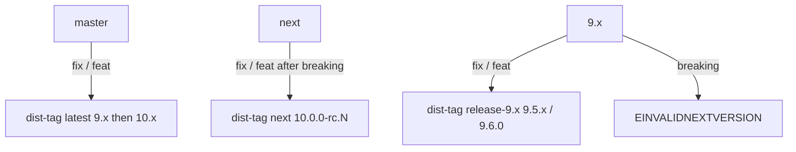
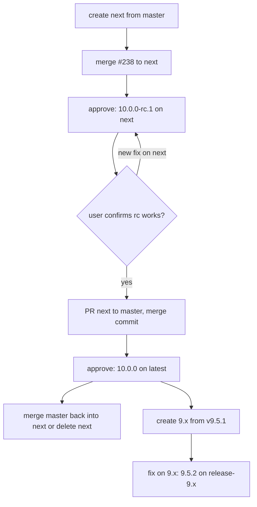

# Semantic-Release Next and Maintenance Channels - Plan

## Goal Capsule

- Objective: maintainers can ship the breaking #238 change as a release candidate that users install with `npm i wait-on@next`, promote it to `10.0.0` on `latest` when a user has confirmed it works, and still ship `9.x` fixes to `^9` users afterwards, all through the existing approved Release run and never from a local machine.
- Means: semantic-release branch configuration, one shared `.releaserc.json` and `release.yml` serving `master`, `next`, and a maintenance glob (KTD1, KTD2).
- Authority: R-IDs own release behavior and runbook content; KTDs own config mechanism; units cite both and add only file-local deltas.
- Execution profile: worktree `.claude/worktrees/ci+release-channels`, branch `ci/release-channels`, based on upstream master `578d46b`; PR from the kevinold fork to jeffbski/wait-on `master`, referencing issue #257; one `ci:` Conventional Commit (body lines <= 100 chars) with this plan and any `docs/solutions/` doc committed alongside.
- Stop conditions: stop and surface if, after pushing a throwaway `feat!:` commit on top of this change to the fork's `next`, the `preview` summary reports anything other than `v10.0.0-rc.1`, if `npm test` goes red, or if meeting a requirement would need a new workflow secret or a local `npm publish`.

---

## Product Contract

### Summary

`.releaserc.json` declares three branch kinds: a maintenance glob, `master`, and `next` as an `rc` prerelease on npm dist-tag `next`. `release.yml` and `node.js.yml` trigger on those branches too. The `publish:next` script goes away. `.github/RELEASING.md` gains a per-scenario runbook (rc on `next`, promote to `10.0.0`, `9.x` fix after `10.0.0`), a per-branch commit-prefix table, and the `release` environment deployment-branch change the maintainer makes once.

### Problem Frame

Release automation serves `master` only. #238 (axios to undici fetch) is a `refactor!:`; merging it to `master` publishes `10.0.0` straight to `latest` with no user trial. The only prerelease path is `npm run publish:next`, a local publish that bypasses OIDC trusted publishing and provenance, and the `next` dist-tag still points at a stale `5.1.0-rc.1`. After `10.0.0`, there is no branch that can ship a `9.x` fix.

### Requirements

**semantic-release configuration**

- R1. `.releaserc.json` `branches` lists, in this order, the maintenance glob `+([0-9])?(.{+([0-9]),x}).x`, `master`, and `{ "name": "next", "prerelease": "rc", "channel": "next" }`.
- R2. A `fix:` or `feat:` on `next` after a breaking commit publishes `10.0.0-rc.N` to dist-tag `next`, GitHub release marked prerelease; `master` keeps publishing `9.x` to `latest` untouched.
- R3. A maintenance branch `9.x` created from `v9.5.1` after `10.0.0` ships accepts `fix:` (`9.5.2`) and `feat:` (`9.6.0`) on dist-tag `release-9.x`; a breaking commit there fails the run with `EINVALIDNEXTVERSION`.

**Workflow triggers**

- R4. `release.yml` and `node.js.yml` run on pushes to `master`, `next`, and `*.x` branches, and `commitlint.yml` lints PRs into those same branches; jobs, matrix, and the `release` job's repository guard are unchanged.
- R5. The `preview` job summary shows the full prerelease version (`v10.0.0-rc.1`, not `v10.0.0`) so the approver reads what will publish.

**Scripts**

- R6. `package.json` has no `publish:next` script; the runbook states that no local publish path exists.

**Runbook (`.github/RELEASING.md`)**

- R7. Setup step 1.4 tells the maintainer to add `next` and `*.x` to the `release` environment's deployment-branch rules alongside `master`, and the "Going fully autonomous" section keeps all three rules.
- R8. A "Release channels" section maps each branch to its dist-tag and version shape, then gives three scenarios as numbered steps: rc on `next` (create `next` from master, retarget and merge #238 with a merge commit, approve, `rc.1` overwrites the stale `next` tag, merge master into `next` periodically, expecting a `package.json`/`package-lock.json` conflict after any master release); promote to `10.0.0` (PR `next` to `master` as a merge commit, then merge master back into `next` or delete it, `next` dist-tag stays on the last rc unless moved by hand); `9.x` fix after `10.0.0` (create `9.x` from the last `v9.*` tag only after `10.0.0` ships, immediately cherry-pick `-x` this `ci:` commit so the branch carries the new triggers and branch config, then cherry-pick `-x` fixes keeping the `fix:` subject, approve). Version-file conflicts in either merge direction resolve by keeping `next`'s dependency set (the #238 runtime deps) plus any dependency change master made, taking either side's `version`, and regenerating the lockfile with `npm install`; semantic-release rewrites `version` on the next run. Each branch runs its own copy of `release.yml` and `.releaserc.json`, so a maintainer checks that a `next` or `*.x` branch's copies match master's before approving its first run.
- R9. The runbook recommends a `9.x` branch (patch + minor) over `9.5.x` (patch only), states the promotion trigger as maintainer judgment once at least one user confirms `wait-on@next` works with a fresh confirmation for each new rc, and forbids squash-merging the promotion PR (a squash body concatenates `[skip ci]` release subjects).
- R10. The commit-type table at the top is replaced by a per-branch table with columns `next` (pre-10), `master` pre-10, `master` post-10, `9.x`, marking `feat!:` on `master` pre-10 as avoid (skips the rc) and on `master` post-10 as route via `next`.
- R11. Troubleshooting gains rows for: `EINVALIDNEXTVERSION` on a maintenance branch (breaking commit or `9.x` created before `10.0.0`), a run that skips with "not configured" (branch not in `.releaserc.json` or not on the remote), a promotion merge that publishes nothing (`[skip ci]` in the head commit), `wait-on@next` resolving to an old rc after promotion, and no Release run on a `9.x` push (branch created without this `ci:` commit). The `EINVALIDNEXTVERSION` row notes the preview summary can still show a version (e.g. `v10.0.0` on `9.x`); the error appears only in the preview log and the release job.
- R12. Step 6's "10.0.0 (after #240)" sentence points to the promotion scenario instead of implying `10.0.0` ships from `master` directly.

### Key Decisions

- KD1. **`next` is an `rc` prerelease branch** (session-settled: user-directed — chosen over `next` as a non-prerelease release branch with byte-identical promotion: the user asked for a release candidate). Governs R1, R2, R8.
- KD2. **Promotion is maintainer judgment after at least one user confirmation per rc** (session-settled: user-directed — chosen over a fixed N-day soak or confirmation count: "I don't want to track this, it will remain an rc for as long as needed"). Governs R9.
- KD3. **`9.x` is created only after `10.0.0` ships** (session-settled: user-approved — chosen over creating it now: a `9.x` created before `10.0.0` has range `>=9.5.1 <9.5.1` and cannot release). Governs R3, R8, R11.

### Scope Boundaries

- Out: creating `next` or `9.x`, retargeting or merging #238, promoting; the runbook documents these maintainer steps.
- Out: any workflow step that moves the `next` dist-tag after promotion (R8 documents the manual `npm dist-tag add`).
- Out: branch protection for `next` or `9.x`; `master` has none today and the `release` environment's required reviewers gate every publish, so the new branches get the same posture. The existing "If `master` gets branch protection later" section applies to them unchanged.
- Out: `lib/`, `bin/`, `test/`, and dependency changes.

### Deferred to Follow-Up Work

- A `release.yml` step that re-points `next` to the promoted stable version.
- Retiring the `9.x` branch and `release-9.x` tag once `10.x` adoption makes it moot.

### Sources

- `.releaserc.json` (branches at line 2), `.github/workflows/release.yml:10-12` (trigger), `:66-70` (preview version grep), `.github/workflows/node.js.yml:6-9`, `package.json:28` (`publish:next`), `.github/RELEASING.md:8-13` (commit table), `:28-29` (step 1.4), `:92` (step 6 `10.0.0` line), `:117-125` (autonomous), `:127-138` (troubleshooting).
- semantic-release 25.0.9 source: `lib/branches/{normalize,expand}.js`, `lib/get-next-version.js`, `lib/get-release-to-add.js`, `index.js:189-190`; `@semantic-release/npm` 13.2.0 `lib/get-channel.js`; gitbook recipes `release-workflow/pre-releases` and `maintenance-releases`.
- jeffbski/wait-on#257 (tracking issue, guide comment), jeffbski/wait-on#238 (the breaking change).

---

## Planning Contract

### Key Technical Decisions

- KTD1. **Branch semantics come from semantic-release, not from per-branch workflows.** The same `.releaserc.json` and `release.yml` content serves every branch, but each branch runs the copy in its own commit, so a branch cut from an old tag needs this change cherry-picked (R8); the branch a PR targets selects version and dist-tag. `next` computes `inc(9.5.1, major)-rc.1` from the highest stable tag reachable, so it must be branched from `master`; missing configured branches are dropped silently, so the glob and `next` cost nothing until they exist. Implements KD1; owns R1, R2.
- KTD2. **Maintenance glob is semantic-release's documented default** `+([0-9])?(.{+([0-9]),x}).x`, matching `9.x` and `9.5.x` but not `master`, `next`, or `v9.x`. Channel defaults to the branch name; `9.x` is a valid semver range so npm publishes to `release-9.x`. Owns R3.
- KTD3. **GitHub push filter is `[master, next, '*.x']`.** `*` matches dots, so `'*.x'` already covers `9.5.x`; `'*.*.x'` is redundant and omitted. Over-matching is harmless because semantic-release re-filters against R1. Quote the glob in YAML. Owns R4.
- KTD4. **Preview grep widens to an optional prerelease suffix** (`-[0-9A-Za-z.-]+`) so the summary and the `version` output carry `10.0.0-rc.1`. Owns R5.
- KTD5. **Per-ref concurrency stays.** `${{ github.workflow }}-${{ github.ref }}` already serializes each branch independently, so a `next` release never blocks a `master` one. No change.
- KTD6. **Runbook binds decisions, not mechanism.** RELEASING.md states each scenario as maintainer steps and cites semantic-release behavior in one line each; it does not restate the version algorithm. Owns R8-R12 shape.

### High-Level Technical Design

Directional sketch of the two config deltas (U1, U2 own the exact edits):

```json
"branches": ["+([0-9])?(.{+([0-9]),x}).x", "master", { "name": "next", "prerelease": "rc", "channel": "next" }]
```

```yaml
on:
  push:
    branches: [master, next, '*.x']
```

Branch to dist-tag mapping:



Lifecycle:



### Risks

| Risk | Mitigation |
|---|---|
| `release` environment deployment-branch rule allows only `master`; the gated job is rejected on `next`/`9.x` | R7 setup step; runbook lists it as a prerequisite before the first `next` release |
| Promotion squash-merge carries `[skip ci]` and suppresses the `master` run | R9 forbids squash for the promotion PR; R11 troubleshooting row |
| `package.json`/`package-lock.json` conflict on `next` to `master` or master into `next` (version fields; taking the wrong side drops the #238 dependency set) | R8: keep `next`'s dependencies plus master's dependency changes, take either `version`, regenerate the lockfile; CI on the merge PR proves it |
| `next` never reconciled after promotion computes `10.0.0-rc.N+1` off stale history | R8: merge master back into `next` or delete it |
| `9.x` created before `10.0.0` fails every release | KD3, R11 |
| `next` dist-tag stays on the last rc after `10.0.0` | Accepted; R8 documents `npm dist-tag add wait-on@10.0.0 next` |
| Fork preview on `next` computes from missing tags | Verification requires the fork to carry the `v9.5.1` tag |
| Stale npm `next` tag `5.1.0-rc.1` | Overwritten by the first `next` publish; stated in R8 |

---

## Implementation Units

### U1. `.releaserc.json` branches

- **Goal:** semantic-release recognizes maintenance, `master`, and `next` branches.
- **Requirements:** R1-R3; KD1, KD3; KTD1, KTD2.
- **Dependencies:** none.
- **Files:** `.releaserc.json`.
- **Approach:** replace `"branches": ["master"]` with the three-entry array in R1; plugins untouched.
- **Patterns to follow:** existing two-space JSON formatting.
- **Test scenarios:**
  - RED (AGENTS.md nearest failing check): before the change, the semantic-release dry run (analysis plugins only, as the `preview` job runs it) on a fork `next` branch reports the branch is not configured.
  - GREEN: the same dry run reports `The next release version is <x.y.z>-rc.1` (`10.0.0-rc.1` when the branch carries a breaking commit, `9.5.2-rc.1` with only a `fix:`).
- **Verification:** fork `preview` run on `next` shows the rc version; `master` run still shows `9.5.x`.

### U2. Workflow triggers and preview summary

- **Goal:** Release and CI run on `next` and maintenance branches, and the approver sees the full rc version.
- **Requirements:** R4, R5; KTD3, KTD4, KTD5.
- **Dependencies:** U1 (a trigger without R1 skips with "not configured").
- **Files:** `.github/workflows/release.yml`, `.github/workflows/node.js.yml`, `.github/workflows/commitlint.yml`.
- **Approach:**
  1. Set `on.push.branches` to `[master, next, '*.x']` in `release.yml` and `node.js.yml`, and `on.pull_request.branches` to the same list in `commitlint.yml`.
  2. Widen the version regex in the `preview` step per KTD4, in both the extract and the `version=` capture.
  3. Update the `release.yml` header comment that says every push to `master` queues a run so it names the three branch kinds.
- **Patterns to follow:** keep pinned action SHAs and job structure; `node.js.yml` keeps `pull_request:` (PRs against `next`/`9.x` already run CI through it).
- **Test scenarios:**
  - RED: push `next` to the fork before the change; no Release or CI run starts.
  - GREEN: both start; `preview` summary reads `Next release: v<x.y.z>-rc.1`.
- **Verification:** fork Actions tab shows Release and CI runs for the `next` push; `release` job is skipped on the fork by the repository guard.

### U3. Remove `publish:next`

- **Goal:** no local publish path remains.
- **Requirements:** R6.
- **Dependencies:** none.
- **Files:** `package.json`.
- **Approach:** delete the `publish:next` script line.
- **Patterns to follow:** none.
- **Test scenarios:** Test expectation: none -- script removal; `npm test` and `npm pack --dry-run` unaffected.
- **Verification:** `npm run publish:next` reports a missing script; no workflow or script invokes it.

### U4. RELEASING.md runbook

- **Goal:** a maintainer can run all three scenarios and the one-time environment change from the runbook alone.
- **Requirements:** R7-R12; KD1-KD3; KTD6.
- **Dependencies:** U1-U3 (documents their behavior).
- **Files:** `.github/RELEASING.md`.
- **Approach:**
  1. Intro sentence covers pushes to `master`, `next`, and `*.x`.
  2. Replace the top commit table with R10's table.
  3. Step 1.4 adds `next` and `*.x` rules; step 6 line per R12.
  4. New `## Release channels` section after "Day-to-day" holding the mapping and three scenarios (R8, R9).
  5. "Going fully autonomous" keeps all deployment-branch rules (R7).
  6. Troubleshooting rows per R11; one line that `publish:next` is gone (R6).
- **Patterns to follow:** existing numbered-step and table style; bold GitHub UI paths; anchors for cross-links.
- **Test scenarios:** Test expectation: none -- docs-only carve-out under AGENTS.md TDD.
- **Verification:** every claim in the section matches U1/U2 behavior observed on the fork; a reader can find the promotion squash warning, the `9.x` timing rule, and the environment setting by heading scan.

---

## Verification Contract

TDD note: AGENTS.md treats CI and config changes as test-first with "the nearest failing check" as RED; U1 and U2 use the fork dry run for that. U4 is the docs-only carve-out.

| Gate | Check | Applies to |
|---|---|---|
| Repo suite | `npm test` (lint + types + mocha) green | U1-U4 |
| Fork rc preview | Push `next` (with `v9.5.1` tag present) plus a throwaway `feat!:` commit to the fork; Release `preview` summary reads `Next release: v10.0.0-rc.1`; delete the throwaway branch afterwards | U1, U2 |
| Fork master preview | Push to fork `master`; preview still computes a `9.5.x` or "No release due" | U1, U2 |
| Fork maintenance preview (optional) | Push a `9.x` branch from `v9.5.1` with this change and one throwaway `fix:` commit to the fork; the preview log (not the summary) shows `EINVALIDNEXTVERSION` (empty range, KD3); delete the branch afterwards | U1 |
| CI trigger | A `next` push starts the CI workflow on the fork | U2 |
| Script gone | `package.json` defines no `publish:next` and no workflow or script invokes it (the runbook may mention its removal) | U3 |
| Runbook completeness | Headings scan finds Release channels, three scenarios, commit-prefix table, step 1.4 rules | U4 |
| Commit hygiene | Single `ci:` commit passes commitlint; PR title is a Conventional Commit | all |

---

## Definition of Done

- R1-R12 met; only `.releaserc.json`, `.github/workflows/release.yml`, `.github/workflows/node.js.yml`, `.github/workflows/commitlint.yml`, `package.json`, `.github/RELEASING.md`, and `docs/**` changed.
- All Verification Contract gates pass; fork run links recorded in the PR body.
- PR to jeffbski/wait-on `master` references #257 and lists the maintainer's one-time environment step.
- This plan and any `docs/solutions/` doc are committed with the change.
- Run `/ce-compound` (`mode:non-interactive` when no human is present) for each non-trivial learning this work produced — new or updated `docs/solutions/` doc in the same PR; never skip the invocation — only that run's own skip report (reason recorded in the PR's Compounding line) satisfies this item when nothing qualified.
- Cleanup: no throwaway test commits, fork-only branches, or abandoned-attempt config left in the diff.
